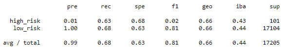
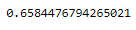
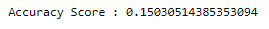

# Credit_Risk_Analysis

## Overview
The purpose of this analysis is to examine credit risk using different models. This analysis will further evaluate the performance of these models and recommend which should be used to predict credit risk.

### Results
- Random Oversampling

  - Accuracy was 64.95%
  - Precision was 1% for high risk results and 100% for low risk results (99% average)
  - Sensitivity was 73% for high risk results and 57% for low risk results (57% average)
  - F1 score was 2% and 72% for high and low results respectively, and 72% average.

- SMOTE Oversampling

  - Accuracy was 65.84%
  - Precision was 1% for high risk results and 100% for low risk results (99% average)
  - Sensitivity was 63% for high risk results and 68% for low risk results (68% average)
  - F1 score was 2% and 81% for high and low results respectively, and 81% average.

- Undersampling

  - Accuracy was 65.84%
  - Precision was 1% for high risk results and 100% for low risk results (99% average)
  - Sensitivity was 67% for high risk results and 42% for low risk results (42% average)
  - F1 score was 1% and 59% for high and low results repectively, and 58% average.

- SMOTEENN

  - Accuracy was 54.44%
  - Precision was 1% for high risk results and 100% for low risk results (99% average)
  - Sensitivity was 72% for high risk results and 57% for low risk results (58% average)
  - F1 score was 2% and 73% for high and low results repectively, and 72% average.

- Random Forest Classifier

  - Accuracy was 15.03%
  - Precision was 1% for high risk results and 100% for low risk results (99% weighted average)
  - Sensitivity was 92% for high risk results and 15% for low risk results (15% weighted average)
  - F1 score was 1% and 25% for high and low results repectively, and 25% weighted average.

- Easy Ensemble Classifier

  - Accuracy was 91.57%
  - Precision was 6% for high risk results and 100% for low risk results (99% weighted average)
  - Sensitivity was 89% for high risk results and 92% for low risk results (92% weighted average)
  - F1 score was 11% and 96% for high and low results repectively, and 95% weighted average.

### Summary
Overall, it appears that the Easy Ensemble Classifier provides the highest accuracy, precision for high risk results, and sensitivity for low risk results at 91.57%, 92%, and 92% respectively. The Random Forest Classifier had the highest sensitivity for high risk results at 92%.
The Easy Ensemble also had the highest F1 scores for low and high results.

If I had to recommend a model, I would recommend the Easy Ensemble. The percentages of model quality is the best in the most categories, meaning that True Positives are identified correctly the most and that the balance of precision and sensitivity is the best.
